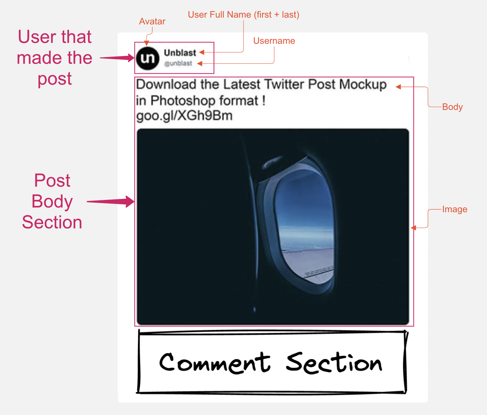
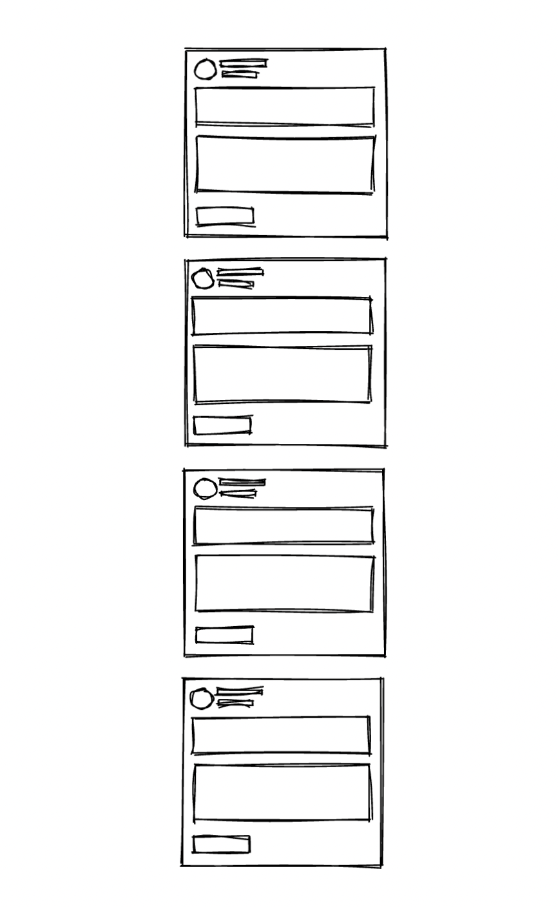

# Practicegenius Frontend Coding Assessment

## My Notes

- I used SWR for the requests. SWR helps to decrease loading times and has a built in caching system. Mutations came in handy when editing and deleting comments.
- I used Tailwind for styling because I am much faster with it and it rocks(in my opinion)!
- I used grays for the element colors because they are unobtrusive and the designer in this senario would hopefully provide a palette when they got bacl from vacation. :laughing:
- In a real world production setting I would probably implement either pagination or some kind of lazy-loading for the posts.
- I would also add a confirmation message when deleting comments to give the user a chance to back out.
- Ocassionally the API would have trouble loading an image file complaining that the file didn't exist. I felt like tracking this down was probably outside the scope of this test. If asked to solve this I would probably just provide a placeholder image if the image failed to load.
- Overall it was a fun challenge! I haven't seen one quite like this before. 


Hello and welcome! This short assessment is designed to be a quick demonstration of your frontend development skills. We are looking to evaluate your ability to

- Fetch, process, and transform data from a REST API
- Use a REST API to create, update, and delete resources
- Use React to build an interactive component with an easy-to-understand API for use by your teammates
- Implement UI elements from a mockup
- Use your creativity to extend an incomplete UI mockup given a written spec

## Problem Statement

There are two goals of this assessment

- Design and build a React component to show a Post and its Comments
- Use the Post feed API to render a list of posts on the index page

The Backend API used by the frontend is provided by this project and is [documented below](#backend-api-documentation)

## Problem Specs

### The Post

The designer provided the following mockup for the Post component


Unfortunately, the designer left for vacation before finishing the mockups for the comments section. However, the product manager is adamant that we ship this feed as soon as possible as it will provide a lot of value. So, we'll have to do our best to design our own comment section given the written specs below. We can always update it if need be when the designer returns from vacation 😉

#### Post Details



- User Section
  - Not all users will upload an avatar. Render a placeholder in that case. How the placeholder looks is up to you
  - The backend API provides usernames without the `@` prefix, but the UI should always render the username including the `@` prefix
- Post Body Section
  - Posts can have a body (string), image (url string), or both. The body should always render above the image if both are provided.
  - All Post images are 400x300
  - The Post body can contain new-line characters. The backend API encodes these as `\n`, but the UI should render these as a visible line break.
- Comment Section
  - Each post can have a list of comments. The UI should only render these if the user wants to see them.
  - When the component first renders, this section only renders a button that
    - Shows the number of comments
    - When clicked: expands the section to reveal the post comments
  - When the comments section is expanded
    - Still show the button to reveal comments, but now it hides the comments when clicked
    - Below the button, show a multi-line text field to allow for writing a comment
    - Next to the text field, show a button that submits the comment. When a comment is submitted successfully, the text field should clear and the new comment should appear in the list below
    - Below the text field, render the list of comments descending from newest to oldest
- Comment component
  - A comment has a user and a body (string)
  - Each comment should show in a mini-card inside the surrounding Post card
  - Present the user's avatar, full name, and username in the same way shown in the Header of the Post
  - Show the comment body next to the user section. It should have a smaller font-size than the body of the Post. Note that like the post body, this can also contain `\n` characters
  - If the logged-in user posted the comment, then they should be able to edit or delete it.

### The Post Feed

On the home page, fetch all the posts and render them in a single column from newest to oldest



- All of the other content on the home page is placeholder and can be deleted

## Assessment Rules and Guidelines

- You may install any third-party libraries you want to help you complete the assessment.
- This assessment uses a freshly-created [Next.js](https://nextjs.org/) project.
- This project uses the standard [routing](https://nextjs.org/docs/routing/introduction) system from Next.js.
- It is required that you provide your solution in Typescript.
- The backend API is implemented with Next.js API routes here. However, the frontend code should treat these APIs a black-box and use client-side fetching techniques to access the data provided by them.
  - The frontend code should not import anything from `api-util/database.js`
  - You should not need to modify any files under `pages/api/` or `api-util/` to complete the assessment.
- The backend API data is randomly generated when you run `yarn dev`. As long as that process keeps running, you can add, edit, and remove comments and your changes will be saved. However, stopping and restarting `yarn dev` will reset the database.
- For determining chronology in backend-provided data: items with a larger `id` value are newer than items with a smaller `id` value
- For determining the logged-in user, `useAuthentication` is provided by `context/Authentication.tsx`. You may use this hook anywhere within the frontend app.

## Starting the app

This guide assumes that you are using [Yarn Classic](https://classic.yarnpkg.com/lang/en/) and [Node.js v16.x](https://nodejs.org/en/download/)

- Install dependencies with `yarn install`
- Run `yarn dev` to start the dev api and frontend server
- The webapp is available at `localhost:3000` and the backend api is available at `localhost:3000/api`

## Backend API Documentation

The backend API is a standard CRUD REST API, is available to the frontend at `/api` and does not require authentication. It provides three resources

### Users

- **Get All Users**: `GET /api/users`
- **Get User By Id**: `GET /api/users/:id`

### Posts

- **Get All Posts**: `GET /api/posts`
- **Get Post By Id**: `GET /api/posts/:id`

### Comments

Comments are fetched via their relationship with their post

- **Get All Comments For Post**: `GET /api/posts/:postId/comments`
- **Get Comment By Id**: `GET /api/posts/:postId/comments/:commentId`
- **Delete Comment**: `DELETE /api/posts/:postId/comments/:commentId`
- **Create Comment**:

```
POST /api/posts/:postId/comments
{
    body: "Comment Body"
}
```

- **Edit Comment**:

```
PATCH /api/posts/:postId/comments/:commentId
{
    body: "Comment Body"
}
```

When creating or editing comments, the logged-in user is inferred by the backend from your authentication session so you don't need to explicitly provide the `userId`.
